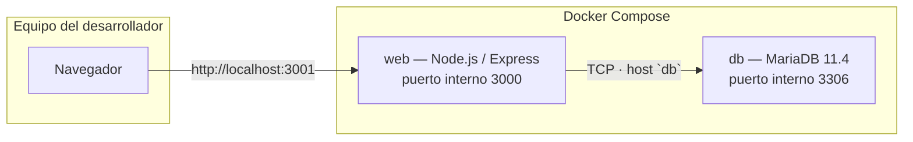

# BookAR — Tienda web (Práctica 3 · Sistemas de Información para Empresas)

**Empresa:** BookAR S.L. · Libros con Realidad Aumentada para entornos educativos.  
**Universidad:** Universidad de Granada (UGR) · Grado en Ingeniería Informática + Administración y Dirección de Empresas (ADE).  
**Grupo 17:** Santiago Perez Delgado, Francisco José Ramos Moya, Santiago Díaz Sabio, Emilio Román Nuñez Hurtado.

Este repositorio implementa un **sistema de información web** que integra interfaz, lógica de negocio y **modelo físico de datos** derivado de la Práctica 1, cumpliendo el **flujo cerrado** exigido en la Práctica 3: los datos críticos residen en MariaDB; el stock se actualiza solo tras una venta registrada de forma **atómica** e **integra**.

---

## Stack tecnológico

| Capa | Tecnología |
|------|------------|
| Backend | Node.js 20+, Express.js |
| Base de datos | MariaDB 11.4 |
| Contenedores | Docker Compose |
| Vistas | EJS (motor de plantillas) |
| Estilos | Tailwind CSS (CDN) + variables CSS desde BD |
| Sesiones | `express-session` |

---

## Arquitectura y entorno (Docker Compose)

La aplicación se despliega como **dos servicios** en una red interna de Docker:



| Servicio | Imagen / construcción | Función |
|----------|------------------------|---------|
| **`db`** | `mariadb:11.4` | Motor relacional; datos persistentes en el volumen `mariadb_data`. |
| **`web`** | `Dockerfile` (Node sobre Debian slim) | API HTTP, renderizado EJS, sesiones y acceso a MariaDB mediante el nombre DNS **`db`**. |
| **`adminer`** | `adminer:latest` | Interfaz web para explorar la base: **`http://localhost:8080`** (solo desarrollo). |

### Autoconfiguración de la base de datos

En el **primer arranque** con volumen vacío, la imagen oficial de MariaDB ejecuta los scripts colocados en `/docker-entrypoint-initdb.d/`. En este proyecto se monta el archivo del repositorio:

| En el host | En el contenedor |
|------------|------------------|
| `sql/schema.sql` | `/docker-entrypoint-initdb.d/01-schema.sql` |

Ese script crea las tablas (`CREATE TABLE IF NOT EXISTS`) y carga los datos iniciales (identidad corporativa **BookAR S.L.** y **12 productos** del catálogo). El fichero fuente en Git es **`sql/schema.sql`**; dentro del contenedor se expone como **`01-schema.sql`** para garantizar el orden de ejecución.

### Acceso a la aplicación

La aplicación queda publicada en el equipo anfitrión en:

```text
http://localhost:3001
```

**Adminer (tablas y SQL en el navegador):** `http://localhost:8080` — Sistema: *MySQL*, Servidor: **`db`**, Usuario: **`root`**, Contraseña: la de `MARIADB_ROOT_PASSWORD` en `docker-compose.yml` (por defecto `bookar_dev_root`), Base de datos: **`bookar_p1`**.

El mapeo de puertos es **`3001` (host) → `3000` (contenedor)** para reducir conflictos con otros servicios locales que usen el puerto 3000. MariaDB **no** expone el puerto 3306 al host por defecto (evita choque con una instalación local); la aplicación y Adminer se conectan por red Docker al servicio `db`.

---

## Modelo de datos (relación con la P1)

La simplificación respecto al modelo conceptual completo mantiene las entidades necesarias para **identidad**, **catálogo**, **clientes** y **cierre contable de ventas**.

### Tabla `EMPRESA`

Almacena la **identidad corporativa** consumida por la página de inicio (fuente única de verdad para misión, visión, socios y **colores hexadecimales** corporativos).

| Columna | Tipo | Descripción |
|---------|------|-------------|
| `id_empresa` | `INT` PK | Identificador (ej. `1`). |
| `nombre` | `VARCHAR(100)` | Razón social (ej. BookAR S.L.). |
| `mision` | `TEXT` | Misión. |
| `vision` | `TEXT` | Visión. |
| `socios` | `TEXT` | Socios del grupo / equipo. |
| `color_primario` | `VARCHAR(7)` | Azul corporativo **`#004B7A`**. |
| `color_secundario` | `VARCHAR(7)` | Naranja AR **`#F58220`**. |

### Tabla `PRODUCTO`

Catálogo de **12 libros** (variantes *Individual* y *Pack Escolar* por asignatura), identificados por **GTIN**. El campo **`stock_actual`** es el núcleo del **cierre de ciclo**: solo debe modificarse dentro de la transacción de venta.

| Columna | Tipo | Descripción |
|---------|------|-------------|
| `gtin` | `VARCHAR(14)` PK | Código GTIN del producto. |
| `nombre_producto` | `VARCHAR(100)` | Denominación comercial. |
| `asignatura` | `VARCHAR(50)` | Área (Anatomía, Historia, Biología, etc.). |
| `precio` | `DECIMAL(10,2)` | Precio vigente en euros (consulta en tiempo real). |
| `stock_actual` | `INT` | **Stock físico** sujeto a `UPDATE` tras venta confirmada. |
| `imagen_url` | `VARCHAR(255)` | URL opcional de imagen. |

### Tablas de clientes y ventas (`CLIENTE`, `VENTA`, `DETALLE_VENTA`)

Implementan el modelo **cabecera–líneas**: un **cliente** genera muchas **ventas**; cada venta tiene una cabecera (`VENTA`) y varias **líneas** (`DETALLE_VENTA`), y cada línea referencia un **producto** por GTIN.

#### Cardinalidad entre tablas

```text
CLIENTE (1) ──────< VENTA (N)              una venta pertenece a un cliente
VENTA (1) ──────< DETALLE_VENTA (N)       varias líneas por venta
PRODUCTO (1) ──────< DETALLE_VENTA (N)    mismo GTIN puede aparecer en muchas líneas (distintas ventas)
```

#### Tabla `CLIENTE`

| Columna | Restricción | Descripción |
|---------|-------------|-------------|
| `id_cliente` | **PK**, `AUTO_INCREMENT` | Identificador único del cliente. |
| `nombre` | `NOT NULL` | Nombre registrado. |
| `email` | `NOT NULL`, **`UNIQUE`** | Correo de acceso; no puede repetirse. |
| `password` | `NOT NULL` | Contraseña almacenada como **hash bcrypt** (no texto plano). |
| `nif_cif` | Opcional | Documento fiscal si se informa en el alta. |

**Claves:** solo **clave primaria** `id_cliente`. No tiene claves foráneas (no depende de otras tablas del modelo).

---

#### Tabla `VENTA`

Cabecera del pedido: vínculo al cliente, marca temporal e importe total acordado al cerrar la compra.

| Columna | Restricción | Descripción |
|---------|-------------|-------------|
| `id_venta` | **PK**, `AUTO_INCREMENT` | Identificador único de la venta. |
| `id_cliente` | **FK → `CLIENTE(id_cliente)`** | Cliente que realiza la compra. En el DDL el tipo admite `NULL`; la aplicación siempre inserta el `id_cliente` de la sesión tras el login. |
| `fecha` | `DEFAULT CURRENT_TIMESTAMP` | Momento de registro del pedido. |
| `total` | — | Importe total persistido al confirmar el checkout. |

**Claves foráneas (definición en `sql/schema.sql`):**

| Columna | Referencia | Comportamiento por defecto |
|---------|------------|------------------------------|
| `id_cliente` | `CLIENTE(id_cliente)` | Sin `ON DELETE` explícito → equivale a **`RESTRICT`**: no se puede eliminar un cliente si existen ventas que lo referencian (hay que borrar o reasignar las ventas antes). |

---

#### Tabla `DETALLE_VENTA`

Detalle de cada línea del ticket: producto vendido, cantidades y **precio unitario histórico** (valor aplicado en la venta, independiente de futuros cambios en `PRODUCTO.precio`).

| Columna | Restricción | Descripción |
|---------|-------------|-------------|
| `id_detalle` | **PK**, `AUTO_INCREMENT` | Identificador de la línea. |
| `id_venta` | **FK → `VENTA(id_venta)`** | Venta a la que pertenece la línea. |
| `gtin_producto` | **FK → `PRODUCTO(gtin)`** | Producto vendido (clave del catálogo). |
| `cantidad` | `NOT NULL` | Unidades de ese producto en la línea. |
| `precio_unitario` | — | Precio aplicado en esa línea (congelado en el momento de la venta). |

**Claves foráneas (definición en `sql/schema.sql`):**

| Columna | Referencia | Comportamiento por defecto |
|---------|------------|------------------------------|
| `id_venta` | `VENTA(id_venta)` | **`RESTRICT`**: no se puede borrar una venta si aún existen filas en `DETALLE_VENTA` que la referencian. |
| `gtin_producto` | `PRODUCTO(gtin)` | **`RESTRICT`**: no se puede borrar un producto del catálogo si hay líneas de venta que conservan ese GTIN (integridad del histórico). |

**Integridad con el checkout:** la aplicación inserta primero **`VENTA`**, obtiene `id_venta`, después las filas de **`DETALLE_VENTA`** y los **`UPDATE`** de `PRODUCTO.stock_actual`, todo dentro de una **única transacción SQL** (`BEGIN` / `COMMIT` / `ROLLBACK`), de modo que no quedan líneas sin cabecera ni descuentos de stock sin venta registrada.

---

## Lógica funcional y flujos críticos

### 1. Identidad dinámica (página de inicio)

En cada petición HTTP, el middleware **`cargarEmpresa`** ejecuta una consulta `SELECT` sobre **`EMPRESA`** y expone el resultado en `res.locals.empresa`. Las vistas inyectan **misión**, **visión** y **socios** sin datos estáticos en código.

Los colores **`color_primario`** y **`color_secundario`** se proyectan como variables CSS (`:root`) en la plantilla base, de modo que la interfaz refleja la identidad almacenada en base de datos.

### 2. Sistema de sesión: visitante vs. cliente

| Estado | Comportamiento |
|--------|----------------|
| **Visitante** | No existe `req.session.clienteId`. Puede navegar inicio, catálogo y carrito; el botón de **confirmar compra** no está operativo como compra definitiva (se indica iniciar sesión o registrarse). |
| **Cliente logueado** | Tras login correcto se guarda `clienteId` (y datos de presentación) en sesión. El **checkout** (`POST /checkout`) está protegido por middleware que exige sesión válida. |

Las contraseñas se almacenan con **bcrypt**; la sesión usa cookie firmada (`express-session`).

### 3. Cierre de ciclo — transacción atómica (integridad del stock)

El requisito de **flujo cerrado** de la Práctica 3 se cumple así: **no se descuenta stock sin registrar venta**, y **no se registra venta sin poder descargar stock**.

El servicio **`crearPedidoAtomico`** (vía `withTransaction` en `config/database.js`) ejecuta en **una sola transacción SQL** (`BEGIN` … `COMMIT` / `ROLLBACK`):

1. **`SELECT … FROM PRODUCTO … FOR UPDATE`** por cada GTIN del carrito: lectura de **precio** y **`stock_actual`** en tiempo real (bloqueo de fila bajo InnoDB).
2. Comprobación de stock suficiente; si falla → `ROLLBACK`.
3. **`INSERT INTO VENTA`** (cabecera con total).
4. **`INSERT INTO DETALLE_VENTA`** por cada línea.
5. **`UPDATE PRODUCTO SET stock_actual = stock_actual - cantidad`** con condición `stock_actual >= cantidad`; si el `UPDATE` no afecta la fila esperada → `ROLLBACK`.

Así se garantiza **atomicidad** y **consistencia**: o se persisten venta, detalles y descuentos de stock, o no queda ningún cambio parcial.

---

## Guía de uso rápida (Docker)

### Requisitos previos

- Docker Engine y Docker Compose v2  
- Puertos libres: **`3001`** en el host para la web (ajustable en `docker-compose.yml`)

### Levantar el entorno

Desde la raíz del proyecto:

```bash
docker compose up --build -d
```

Equivalente mediante `npm`:

```bash
npm run docker:up
```

Abrir el navegador en **`http://localhost:3001`**.

### Ver logs

Solo del servicio web:

```bash
docker compose logs -f web
```

O con npm:

```bash
npm run docker:logs
```

Todos los servicios:

```bash
docker compose logs -f
```

### Detener contenedores

```bash
docker compose down
```

o `npm run docker:down`.

### Resetear por completo la base de datos (volumen)

Borra el volumen persistente de MariaDB; en el **siguiente** `up`, se volverán a ejecutar los scripts de `/docker-entrypoint-initdb.d/` (incluido `01-schema.sql`).

```bash
docker compose down -v
docker compose up --build -d
```

**Advertencia:** elimina también datos de **clientes registrados** y **ventas** almacenados en ese volumen.

---

## Ejecución sin Docker (opcional)

1. Instalar Node.js ≥ 18 y MariaDB accesible localmente.  
2. Copiar `.env.example` a `.env` y configurar `DB_HOST`, `DB_USER`, `DB_PASSWORD`, `DB_NAME`.  
3. Cargar el esquema y datos: `npm run db:setup` (requiere credenciales válidas) o importar `sql/schema.sql` manualmente.  
4. Arrancar: `npm start` o `npm run dev`.

---

## Estructura relevante del repositorio

```text
WEB/
├── app.js                 # Entrada Express, sesión, middleware empresa
├── config/database.js     # Pool MariaDB y helper de transacciones
├── middleware/            # Sesión cliente, carga EMPRESA
├── routes/                # Rutas HTTP
├── utils/
│   └── currency.js        # Formato EUR (es-ES) para vistas y mensajes
├── services/pedidoService.js   # Transacción atómica VENTA / stock
├── views/                 # Plantillas EJS + Tailwind
├── sql/
│   ├── schema.sql         # DDL + datos (EMPRESA + 12 PRODUCTO)
│   └── seed_datos_grupo17.sql
├── scripts/setup-db.js    # Carga SQL sin Docker (opcional)
├── Dockerfile
└── docker-compose.yml
```

---

## Referencias normativas (Práctica 3)

Este proyecto demuestra:

- **Fuente única de verdad** en MariaDB para precios, stock e identidad corporativa.  
- **Separación de roles** visitante / cliente mediante sesión.  
- **Cierre de ciclo transaccional**: venta registrada y **`stock_actual`** actualizado en el mismo bloque SQL atómico, alineado con los objetivos de integridad y trazabilidad del **flujo cerrado** en Sistemas de Información para Empresas.

---

*Documentación generada para el curso académico correspondiente · UGR.*
